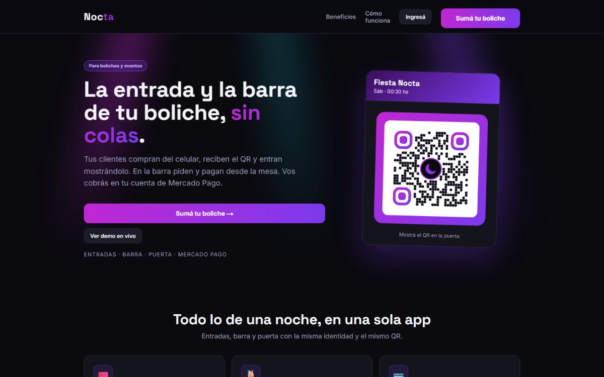

<h1 align="center">Gabriel Dino</h1>

  Fotógrafo y realizador audiovisual. Estudiante de programación en la UTN. 
  <b>Escribo software que después alguien usa para trabajar.</b>

  
  
  
  
  
  

---

Vengo de la ingeniería química y trabajo hace años en proyectos audiovisuales y
en redes. Ahora estoy metiéndome de lleno en programación, y casi todo lo que
escribo sale de mi propio trabajo: de una tarea que venía haciendo a mano, de un
programa que salía demasiado caro o de algo que un cliente necesitaba y no
existía.

Eso hace que mis proyectos tengan un usuario real desde el primer día —a veces
soy yo, a veces alguien que me contrata— y que la prueba de que funcionan sea que se
sigan usando el fin de semana siguiente.

## En qué estoy trabajando

### [Nocta](https://www.nocta.com.ar) · entradas y compras en barra automatizadas.

Producto que armamos con un amigo y que hoy está en producción. El lugar vende
las entradas online y el cliente entra mostrando un **QR** desde el celular; en
la barra pasa lo mismo, así que se saltea la cola de la caja. La plata va
directo a la cuenta de **Mercado Pago** del local, que además ve sus números en
vivo y controla el ingreso desde la puerta.

  

`Next.js` · `Mercado Pago` · `Vercel` — 🌐 **[nocta.com.ar](https://www.nocta.com.ar)**

### [Nicolás Piña](https://github.com/gabrieldino16/web-nicolas_pina) · sitio para un fotógrafo

Web para un cliente, con dos funciones que le resuelven el día a día: un panel
privado donde arma **presupuestos en PDF** en menos de un minuto, y una página
de beneficios a la que solo se llega **escaneando el QR** de sus tarjetas
personales. Las galerías se leen de su cuenta de SmugMug —y se abren por
disciplina en la sección de deportes—, así que sube las fotos como siempre y la
web se actualiza sola.

  
  

Capturas del mismo sistema ya publicado para otro estudio, con su identidad.

`Next.js` · `TypeScript` · `Tailwind` · `jsPDF` · `Vercel`

### [DSRL-booth](https://github.com/gabrieldino16/DSRL-booth) · fotocabina para eventos

Aplicación de escritorio para reemplazar el programa de fotocabina que usaba,
que cuesta una suscripción mensual. Superpone marcos sobre las fotos, las deja
listas para imprimir a 300 DPI y las entrega al invitado por QR o email. La
captura directa desde cámaras Canon está en desarrollo.

`Python` · `PySide6` · `Pillow`

### [Autoclicker](https://github.com/gabrieldino16/Autoclicker) · automatización de tareas repetitivas

Graba una secuencia de teclas y la repite las veces que haga falta. Nació de
tener que emitir más de doscientos tickets de consumición cada fin de semana,
uno por uno. Manda las teclas por códigos de escaneo, así funciona con cualquier
distribución de teclado y en programas que ignoran los métodos más simples.

`Python` · `tkinter` · `WinAPI` · `PyInstaller`

## En la facultad

### [Gestión de bares](https://github.com/Tariima/TPIP3) · trabajo integrador de Programación III

Sistema de gestión para bares hecho **en equipo**, de a cuatro: mesas, pedidos y
la operación del salón. Fue mi primer proyecto trabajando sobre el repositorio de
otra persona, con ramas y revisiones de por medio en lugar de programar solo.

`JavaScript` · `React`

---

  

<!-- Perfil de GitHub: este archivo se muestra en github.com/gabrieldino16 -->
